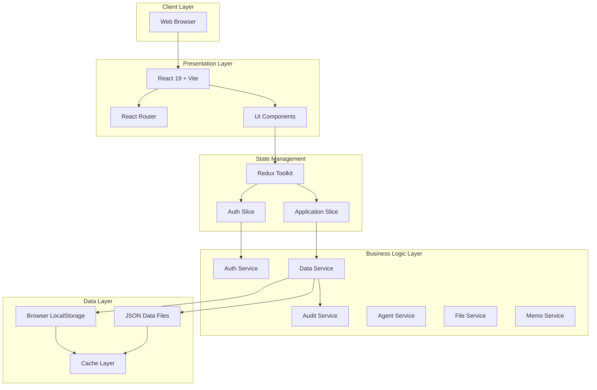
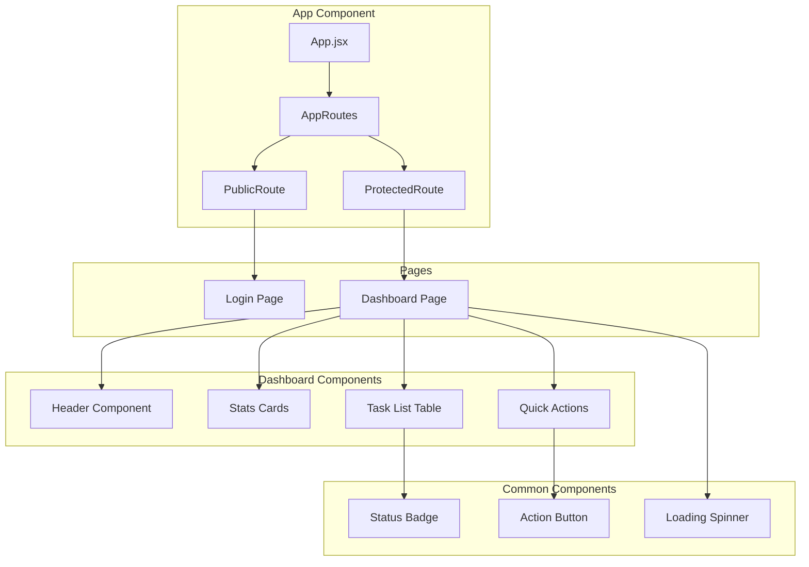
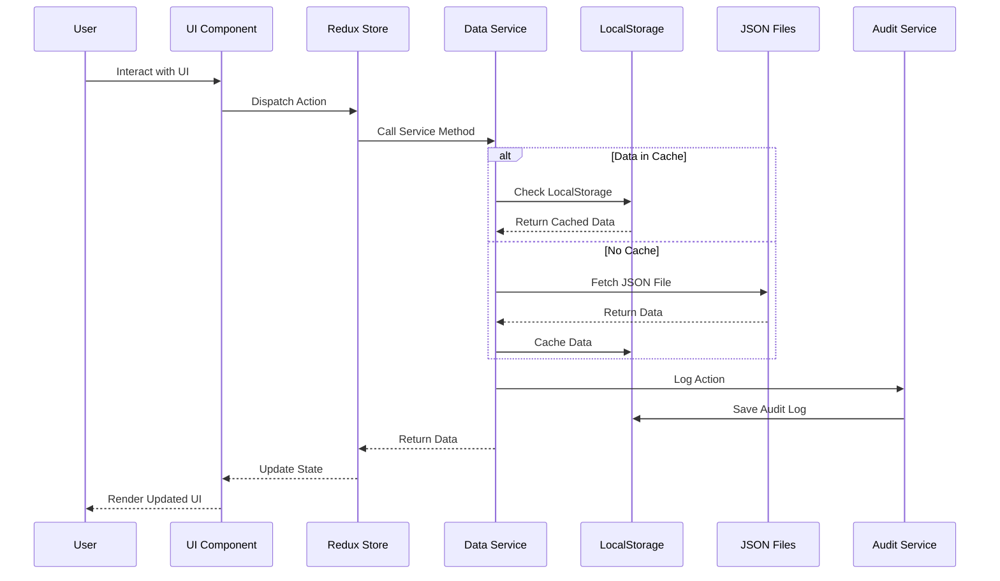
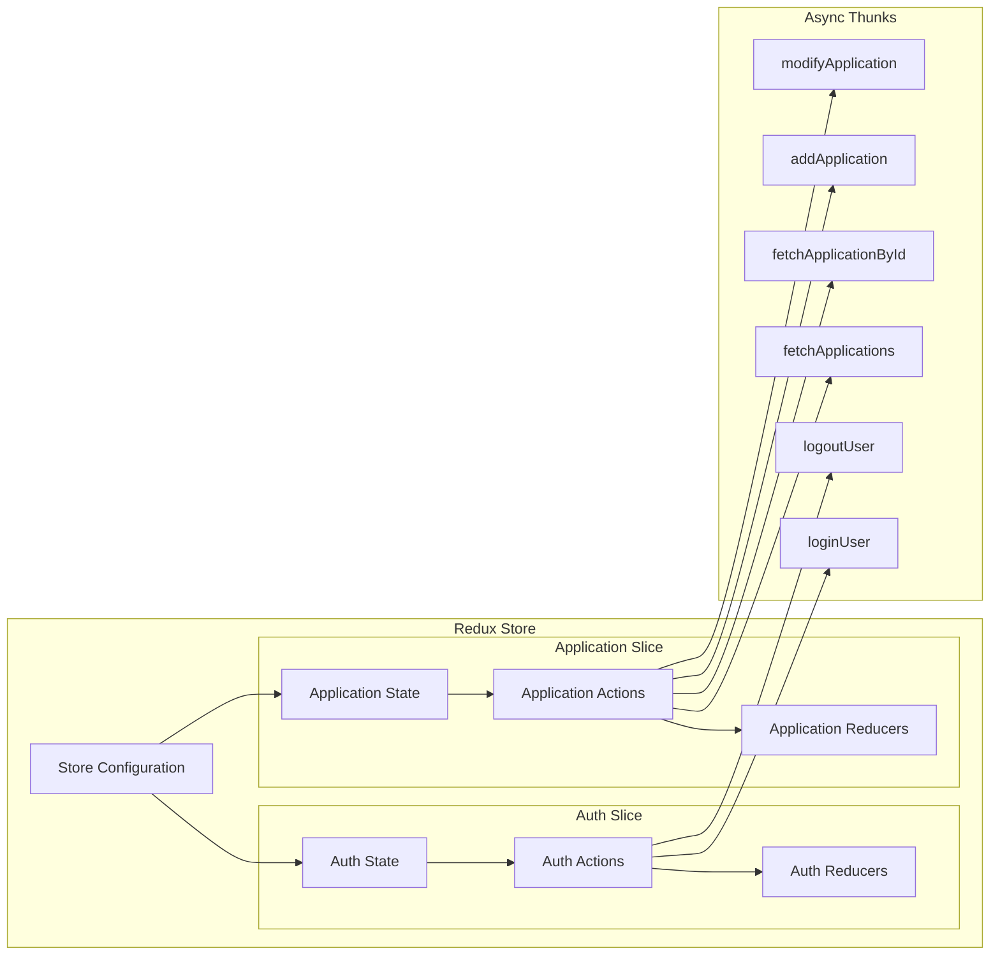
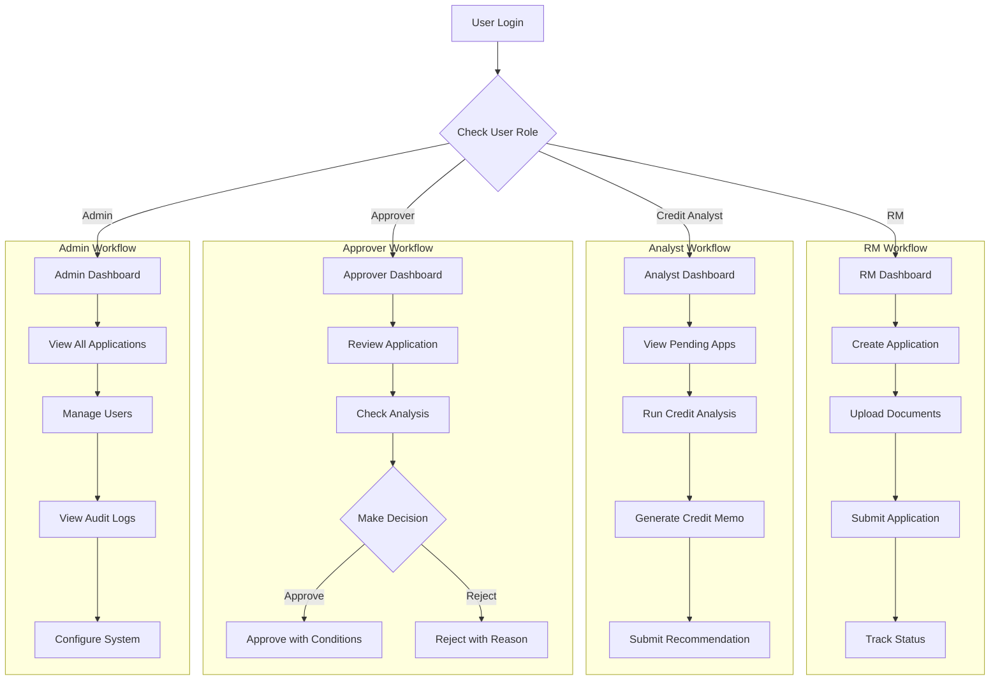
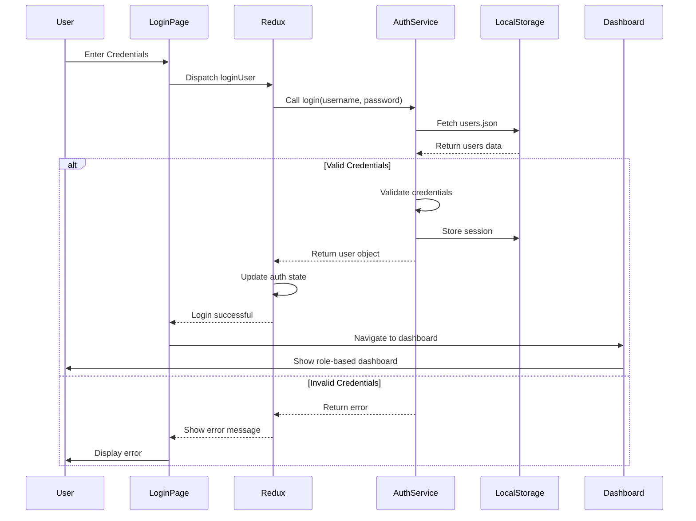

# LOS MVP Architecture Diagrams

Comprehensive architecture documentation using Mermaid diagrams for the Loan Origination System MVP.

## Table of Contents
1. [System Architecture Overview](#1-system-architecture-overview)
2. [Component Architecture](#2-component-architecture)
3. [Data Flow Diagram](#3-data-flow-diagram)
4. [State Management Architecture](#4-state-management-architecture)
5. [User Role Workflow](#5-user-role-workflow)
6. [Service Layer Architecture](#6-service-layer-architecture)
7. [Authentication Flow](#7-authentication-flow)
8. [Application Lifecycle](#8-application-lifecycle)
9. [Technology Stack](#9-technology-stack)

---

## 1. System Architecture Overview



---

## 2. Component Architecture



---

## 3. Data Flow Diagram



---

## 4. State Management Architecture



---

## 5. User Role Workflow



---

## 6. Service Layer Architecture

```mermaid
graph TB
    subgraph "Service Layer"
        subgraph "Auth Service"
            Login[login]
            Logout[logout]
            GetCurrentUser[getCurrentUser]
            ValidateSession[validateSession]
        end
        
        subgraph "Data Service"
            GetAllApps[getAllApplications]
            GetAppById[getApplicationById]
            CreateApp[createApplication]
            UpdateApp[updateApplication]
            DeleteApp[deleteApplication]
            SubmitApp[submitApplication]
            GetDocs[getAllDocuments]
            AddDoc[addDocument]
            GetAnalysis[getAllAnalyses]
            SaveAnalysis[saveAnalysis]
            GetDecisions[getAllDecisions]
            ApproveApp[approveApplication]
            RejectApp[rejectApplication]
        end
        
        subgraph "Audit Service"
            LogAction[logAuditAction]
            GetAuditLogs[getAuditLogs]
            GetUserActions[getUserActions]
        end
        
        subgraph "Agent Service"
            RunAgent[runAgentAnalysis]
            GetAgentResult[getAgentAnalysisResult]
        end
        
        subgraph "File Service"
            UploadFile[uploadFile]
            DeleteFile[deleteFile]
            GetFileUrl[getFileUrl]
        end
        
        subgraph "Memo Service"
            GenerateMemo[generateCreditMemo]
            GetMemoTemplate[getMemoTemplate]
        end
    end
    
    subgraph "Data Sources"
        LocalStorage[(LocalStorage)]
        JSONFiles[(JSON Files)]
    end
    
    GetAllApps --> LocalStorage
    GetAllApps --> JSONFiles
    CreateApp --> LocalStorage
    UpdateApp --> LocalStorage
    LogAction --> LocalStorage
    UploadFile --> LocalStorage
```



---

## 7. Authentication Flow



---

## 8. Application Lifecycle

```mermaid
stateDiagram-v2
    [*] --> Draft: RM Creates Application
    
    Draft --> Submitted: RM Submits Application
    Draft --> [*]: RM Deletes Draft
    
    Submitted --> InReview: Analyst Starts Analysis
    
    InReview --> InReview: Analyst Updates Analysis
    InReview --> Submitted: Analyst Returns for More Info
    
    InReview --> Approved: Approver Approves
    InReview --> Rejected: Approver Rejects
    
    Approved --> Completed: Loan Disbursed
    Rejected --> [*]: Application Closed
    Completed --> [*]: Application Archived
    
    note right of Draft: Status: DRAFT<br/>Owner: RM<br/>Actions: Edit, Submit, Delete
    note right of Submitted: Status: SUBMITTED<br/>Visible to: Analyst<br/>Actions: Start Analysis
    note right of InReview: Status: IN_REVIEW<br/>Visible to: Analyst, Approver<br/>Actions: Analyze, Recommend, Approve, Reject
    note right of Approved: Status: APPROVED<br/>Actions: Disburse Loan
    note right of Rejected: Status: REJECTED<br/>Actions: View Only
```

---

## 9. Technology Stack

```mermaid
graph TB
    subgraph "Frontend Framework"
        React[React 19.2.0]
        ReactDOM[React DOM 19.2.0]
        Vite[Vite 7.3.1]
    end
    
    subgraph "State Management"
        ReduxToolkit[@reduxjs/toolkit 2.11.2]
        ReactRedux[react-redux 9.2.0]
    end
    
    subgraph "Routing"
        ReactRouter[react-router-dom 7.13.1]
    end
    
    subgraph "Utilities"
        UUID[uuid 13.0.0]
        DateFns[date-fns 4.1.0]
    end
    
    subgraph "Development Tools"
        ESLint[ESLint 9.39.1]
        ViteReact[@vitejs/plugin-react 5.1.1]
        TypeScript[TypeScript Types]
    end
    
    subgraph "Data Storage"
        LocalStorageAPI[LocalStorage API]
        JSONData[JSON Files]
        CacheLayer[Cache Layer]
    end
    
    React --> ReduxToolkit
    React --> ReactRouter
    React --> ReactDOM
    ReduxToolkit --> ReactRedux
    Vite --> ViteReact
    React --> UUID
    React --> DateFns
    React --> LocalStorageAPI
    LocalStorageAPI --> JSONData
    LocalStorageAPI --> CacheLayer
```

---

## Architecture Highlights

### Key Design Patterns

1. **Service Layer Pattern**
   - Separation of business logic from UI components
   - Centralized data access through service modules
   - Consistent error handling and logging

2. **Redux State Management**
   - Centralized application state
   - Predictable state updates through reducers
   - Async operations handled by Redux Toolkit thunks

3. **Role-Based Access Control (RBAC)**
   - Four distinct user roles: RM, Credit Analyst, Approver, Admin
   - Role-specific dashboards and actions
   - Filtered data views based on user permissions

4. **Caching Strategy**
   - LocalStorage caching for improved performance
   - Fallback to JSON files when cache is empty
   - Cache invalidation on data updates

5. **Audit Trail**
   - Comprehensive logging of all user actions
   - Immutable audit records
   - Timestamp and user tracking for compliance

### Performance Optimizations

- **Lazy Loading**: Components loaded on demand
- **Memoization**: Redux selectors for derived state
- **Caching**: LocalStorage for frequently accessed data
- **Efficient Rendering**: React 19 concurrent features

### Security Considerations

- **Client-Side Authentication**: Session management via LocalStorage
- **Role-Based Authorization**: Access control at component level
- **Audit Logging**: Complete action tracking
- **Data Validation**: Input validation at service layer

---

## File Structure

```
los-mvp/
├── src/
│   ├── App.jsx                 # Main application component
│   ├── main.jsx               # Application entry point
│   ├── pages/
│   │   ├── Login.jsx          # Login page
│   │   └── Dashboard.jsx      # Role-based dashboard
│   ├── store/
│   │   ├── store.js           # Redux store configuration
│   │   └── slices/
│   │       ├── authSlice.js   # Authentication state
│   │       └── applicationSlice.js  # Application state
│   ├── services/
│   │   ├── authService.js     # Authentication logic
│   │   ├── dataService.js     # Data CRUD operations
│   │   ├── auditService.js    # Audit logging
│   │   ├── agentService.js    # AI agent integration
│   │   ├── fileService.js     # File management
│   │   └── memoService.js     # Credit memo generation
│   └── utils/
│       ├── constants.js       # Application constants
│       └── calculations.js    # Financial calculations
├── public/
│   ├── data/                  # JSON data files
│   └── config/                # Configuration files
└── package.json               # Dependencies
```

---

**Generated with IBM Bob - Architecture Documentation**